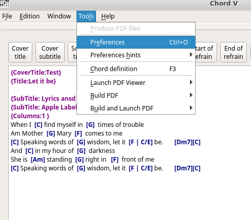
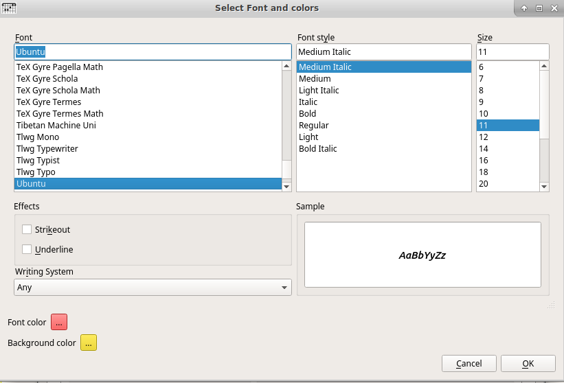

% Chord V user documentation 
% Gilles Maire 
% juin 2017

# Introduction

## Presentation

- ChordV allows you to produce different types of PDF files for
list of songs
- ChordV provides:
    - a text editor with syntactic colorization and insertion of
    Tags in cho format
    - an chords manager and a guitar chord basis
    To add or insert chords
    - four processors to generate a book containing the
    Lyrics without the chords, a book with
    Chords and lyrics, a book with chord grids
- For each of the modes, the options management makes it possible to
Appropriate settings
   - ** Text: ** in this mode, the lyrics alone appear, without
   No chord representation
   - ** Lyrics: ** In this mode, text and chords are displayed.
   - ** Chords: ** in this mode, chords are not displayed. It is
   Useful for accompanying musicians.
   - ** Memory: ** in this mode, only the beginning of the text are displayed

- ChordV uses a very efficient and simple tag language:
   
   
~~~
{title:Let it be}

{subtitle: Lyrics ansd music :  Paul McCartney, John Lennon}
{Subtitle: Apple Label}
{columns:1 }
When I  [C] find myself in  [G]  times of trouble
Am Mother  [G] Mary  [F]  comes to me
[C] Speaking words of  [G] wisdom, let it  [F | C/E] be.       [Dm7][C]
And  [C] in my hour of  [G]  darkness
She is  [Am] standing  [G] right in   [F]  front of me
[C] Speaking words of  [G] wisdom, let it  [F | C/E] be.       [Dm7][C]
~~~~

## Batch mode and graphic mode

- Without any argument chordV is launched with a GUI
- With the -t chordV argument does not start the GUI and
will produce the PDFs for the default configuration
- You can also run chordV with a file.chop argument
to open it automatically at startup.

# Software preferences

## The general preferences

- Preferences allow you to set options for all
songbooks to allow  a collection of book with the same aspect
- Imagine that you want to build a collection of songs from
Beatle's song, a collection of David Bowie songs and a collection 
of Jango Renhardt chords . For each of these collections, you can choose
You may wish to define the same formats for each of them, or at least 
some common options in fonts characters or other. 
It is in the preferences that you can these global options, even if
they can be adapted to each artists thereafter
- It should be noted that there are shortcuts of preferences called
Preferably gadgets.
   - One allows you to return to the initial choices of the software at
   Cases where your tests are not satisfactory
   - One allows you to set a setting for an artist like the
   Default setting in the future.

## The preferences menu

- Preferences are accessed via the Preferences menu or by the shortcut
Keyboard CTRL + O as shown in the following figure

## General preferences

1. You can choose the language of the software. If your language is not 
in the list, you can make a translation file
(See part # (translation-of-software-in-a-language))
2. Select the measurement system that is most convenient for you
cm, mm and inch
3. ChordV launches a PDF reader when you want to view
the delivered generated by the application. In this area,
the name of the program
4. The name of the booklet author can be entered here. It will be used
in the production of documents.

## The options for each booklet mode

These options are not necessarily exactly the same for each
booklet, indeed in text mode the font of the chords does not exist
since in this mode the chords do not exist. We will
separate the presentation of the common and specific options
in each mode.

There are two tabs, one called Document, and the other one for
each of the

### Common options on the Document tab

1. Width selection area. If you put values ​​here
Corresponding to an existing format, this format will be displayed in the
3.
2. Height selection area. If you put values ​​here
Corresponding to an existing format, this format will be displayed in the
3. This field allows you to choose a PDF format by an IS0 name. Yes
You select a format from this menu, you will see the sizes
Displayed in zones 1 and 2
4. Italian inverses the heights and widths
5. Select the default font for the document. Refer
To the documentation relating to
[Font Selection] (# Font Selection)
6. Select the font for the titles on each page.
If you select a background color (Refer to
To the documentation relating to
[Font Selection] (# font-selection), a color frame
Selected will frame the title over the entire width of the page.
7. Select the subtitle font for each subtitle.
page. If you select a background color (Refer to
To the documentation relating to
[Font Selection] (# font-selection), a color frame
Selected will frame the title over the entire width of the page.
8. Selects 1-sided or 2-sided. If you select the
Duplex mode, page numbers if they are offset to the right
Will be eccentric to the left one page out of two.
9. By specifying the color of the paper, the frame colors of the titles
And subtitles if they are of this color will not be drawn.
This avoids erasing characters that could be set under
the framework.
10. This field is used to number the pages with the number on the right,
Center or left
11. Selects the page numbering style 1, - 1 - or 1 / n
12. This area allows you to choose the typeface of the
Page numbers. If the font color is not the same
To the color of the paper a frame will be drawn around the page number.
13. Sets the horizontal margin
14. Set the vertical margin

### Common options on the Content tab

1. The PDF file includes a cover
2. The font of the cover is positioned
3. The title may be one-third of the height, half or two-thirds
4. Selecting an optional image for Coverage
5. Table of Contents in compressed Mode
6. Number of columns in table of contents
7. Typeface used for table of contents
8. Characters used between the title name and the page in the table
subjects
9. Position of the table of contents at the beginning, at the end of the document or
No table of contents
10. Extension added to the output file
11. Vertical Spacing
12. Opening the PDF in full screen mode
13. Force titles in uppercase

## Conventions

### Select fonts

Select fonts to select the font family
Its size, its style and all the traditional options
To which are added:
    - the background color
    - the color of the font
Selecting a color will change the color of the button to
Show you the color it contains
An explanation of background color is required.

# The edit window

## Presentation

### The Edit Window

1. The edit menu allows you to access the replace functions
and zoom the font. Next to the menu items
keyboard shortcuts.
2. The icons are used to insert the Hedging Notes, the
and all the information that is highlighted in purple in the figure.
3. The text box allows you to enter the songs in
chord pro
4. The log section displays error messages labeled in red
and success messages labeled green.
5. When you select a chord, by pressing the
Mouse up or down you go up or down the duration of a
chord. Thus we pass from [Do#x2] to [Do#] and then to [Do:2] by turning
the wheel to yourself.

### The chord pro tag language

It may be strange that modern software does not
WysiWyg interface, that looks like the output
paper. Actually ChordV takes only one input format and is capable of
to generate a text booklet, a booklet of text and chords, a booklet
with chords grids and memory aid. In what mode
He choose to work? We chose the tag mode that
a pivot format.

In addition this pivot format is written in the chord pro language of the
extensions useful to the program. So you can load in ChordV
all chord pro files available in the resources
music of the net.

## Inserting chords in the editor

By double clicking on the text the chord inclusion window you
allows you to select a chord by pressing the insert button
the chord. This action may also be supported by the
the F4 key (while the F3 key is used to enter the
Management of chords)

You can change the tempo by using the mouse wheel
by holding down the SHIFT key in the editor.

# Technical part

## Keyboard shortcuts - Mouse actions

### Keyboard shortcuts

------------------------------------------------------------
 Shortcuts    Action            Shortcut     Action
------------ --------------- ------------ ------------------ 
  CTRL + F    Search              F1          Documentation
  
  CTRL + O    Preferences         F2
  
  CTRL + R     Replace            F3          Define chords
  
  CTRL + S     Save               F4         Insert chord
  
  CTRL + +     Zoom +             F5         Produce PDF  in text mode
  
  CTRL + -     Zomr -             F6         Produce PDF in text and lyrics mode
  
					              F7         Produce PDF in grid mode
  
-------------------------------------------------- -----------
: Keyboard shortcuts

## Translation of the software into a language

### Presentation

- You do not need the source codes to translate the software.
- If you go to the system menu of the application, you
Find the path of the configuration file for example:

~~~ bash
/home/gilles/.config/ChordV/ChordV.conf
~~~
- in the /home/gilles/.config/ChordV/ directory are the files
languages ​​in the Languages ​​containing languages
written with the name in the translated language. For French it will be found
whe name with the cedille exactly as a French could read it.
- Inside the French repertory there are three files
    - fr.png: this file is a flag of the language in png format
    - fr.ts: this file is the file containing the translation pairs
    - fr.qm: this file contains the compiled ts file
    - fr.html : the documentation of software translated

### Translation of the file fr.ts

- Create a language directory with the name for example Español
- Copy the file fr.png to es.pgn
- You can download the linguist program and open the file fr.png
- In linguist save the es.ts file and activate the menu
File / Publish ts.qm will be created
- Do not forget to write to the author of the software to
Es.ts file so that it is included in the next software distribution

## Documentation of Chord V

## Presentation

The documentation is accessible in the software via the help menu
To the Documentation item.

This documentation has been automatically
From the Markdown to HTML format via the Pandoc program.

The documentation file is located in the directory cited part
[Translation of the software into a language] (# translation-of-software-in-a-language)

### Translation Process

If you wish to translate the software documentation, you must
The md file in the desired language, convert it via a translator
Automatic and correct it.

Beware because the translator tends to transform the codes
Md style

~~~ md
! [The editing window] (./img/ editor.png)
~~~

in

~~~ md
! [The editing window] (./img/editor.png)
~~~

Once the file is translated, you can convert it to html format
Via the command (after retrieving the css style sheet on
the Internet)

~~~ bash
Pandoc --toc --ascii --smart -N --css = pandoc.css --from = markdown --to = html --output = es.html es.md
~~~

### Images

The images are to be included in the img directory of the / es languages ​​directory,
They come from screenshots. If you use gimp you can use
The plugin drawnumbers which allows to produce the red pellets.

It is available at
[Draw-number] (xhttp: //www.gillesmaire.com/tiki-index.php page = draw-numbers?)

## Compatibility Chordpro

### Introduction

Chord V is designed to produce 4 types of documents at the same time
and some chord pro tags are designed for a single use. So we
do not want to output the same format for each of the
documents, knowing that the booklets of words are perhaps intended
to a printed file and the tuning grid files may be
be for PDF files for a reader or tablet.

Chord reads Chordpro ​​files and knows how to extract
ChordPro compatible file.

Some tags are not used because replaced by the graphical interface.

### Compatibility ChordPro 2ii

-----------------------	    ----------------------
ChordPro 2ii                           Chord V
--------------------    	------------------
{New_song} {ns} 				Read but replaced by title

{Title} {t} 								X

{Subtitle} {st} 							X

{Comment: text} {c: text} 					X

{Comment_italic: text} {ci: text} 			X

{Comment_box: text} {cb: text} 				X

{Start_of_chorus} {soc} 					X

{End_of_chorus} {eoc} 						X

{Start_of_tab} {sot} 						nOn

{End_of_tab} {eot} 						nOn

{Define ...} biEntot

{Textfont: fontname} {tf: fontname} 	Graphical interface

{Textsize: fontsize} {ts: fontsize} 	graphic interface

{Chordfont: fontname} {cf: fontname} 	Graphical interface

{Chordsize: fontsize} {cs: fontsize} 	graphic interface

{No_grid} {ng}							 nOn

{Grid} {g} 								 nOn

{Titles: flush} 						nOn

{New_page} {np} 					   ASAP

{New_physical_page} {npp} 				nOn

{Columns: number} {col: number} 	    X

{Column_break} {colb}                   X

{Pageize: type} {papersize: type}  	Graphical interface

-------------------------------------------------- ----------------------
:: List of commands chordpro ​​2ii
