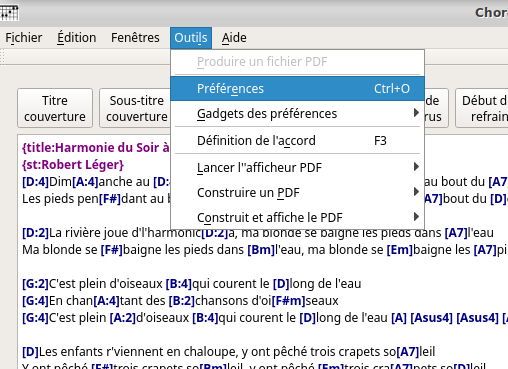
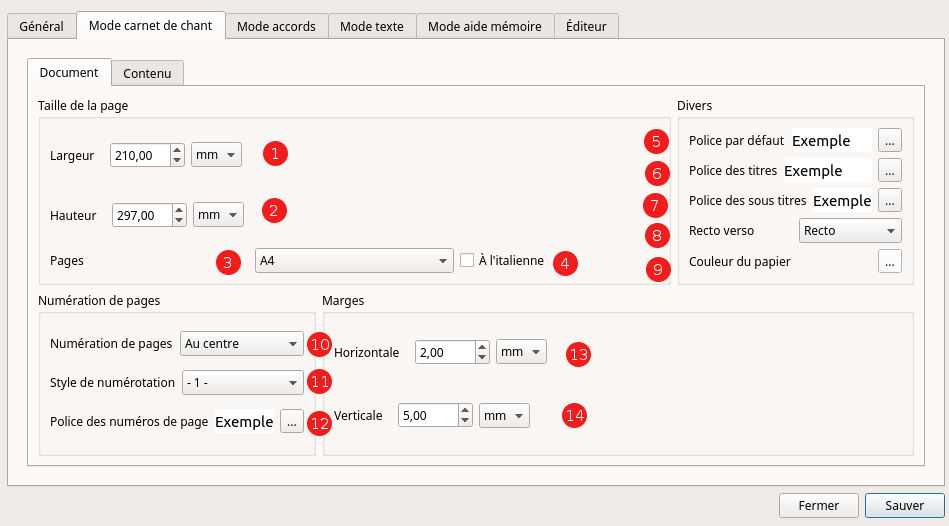
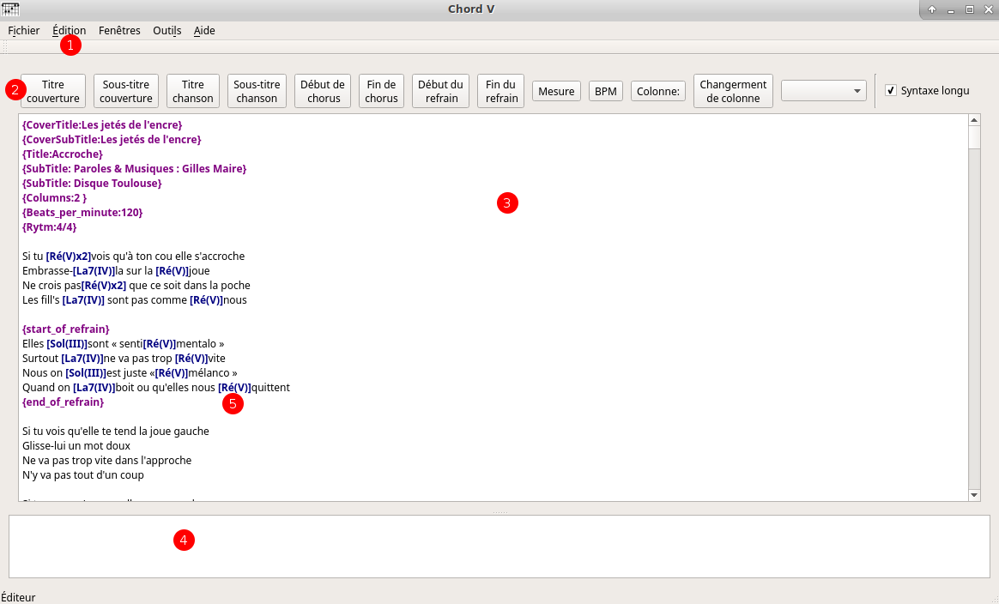

% Documentation utilisateur de chord V
% Gilles Maire 
% juin 2017

# Introduction 

## Présentation 

- ChordV permet de produire différents types de fichiers PDF pour une 
liste de  chansons
- ChordV fournit :
    - un éditeur de texte avec colorisation syntaxique et insertion des 
    balises au format cho
    - un gestionnaire d'accords et d'une base d'accords guitare 
    permettant d'ajouter ou d'insérer les accords
    - quatre processeurs permettant de générer un livre contenant les 
    paroles sans les accords, un livre avec
    accords et paroles, un livre avec les grilles d'accords
- Pour chacun des modes la gestion des options permet de faire les 
réglages idoines
   - **Texte :** dans ce mode, les paroles seules apparaissent, sans 
   aucune représentation d'accord
   - **Lyrics :** dans ce mode, le texte et les accords sont affichés.
   - **Accords :** dans ce mode, les accords ne sont affichés. Il est 
   utile pour les musiciens d'accompagnement.
   - **Mémoire :** dans ce mode, seul le début du texte sont affichés

- ChordV utilise un langage de balises très efficace et simple:

~~~
{title:Let it be}

{subtitle: Lyrics ansd music :  Paul McCartney, John Lennon}
{Subtitle: Apple Label}
{columns:1 }
When I  [C] find myself in  [G]  times of trouble
Am Mother  [G] Mary  [F]  comes to me
[C] Speaking words of  [G] wisdom, let it  [F | C/E] be.       [Dm7][C]
And  [C] in my hour of  [G]  darkness
She is  [Am] standing  [G] right in   [F]  front of me
[C] Speaking words of  [G] wisdom, let it  [F | C/E] be.       [Dm7][C]
~~~~

## Le mode batch et le mode graphique

- Sans aucun argument chordV est lancé avec une interface graphique
- Avec l'argument -t chordV ne lance pas l'interface graphique et 
produira les  PDF pour la configuration par défaut
- Vous pouvez également lancer chordV avec un argument fichier.chop  
pour l'ouvrir automatiquement au démarrage.

# Les préférences du logiciel

## De l'utilité des préférences

- Les préférences permettent de définir les options pour tous les 
recueils de chanson afin de rendre homogène une collection de recueils.
- Imaginons que vous souhaitiez construire un recueil des chansons de 
Brassens, un recueil des chansons de Renaud et un recueil des chansons
de Jeanne Chéral. Pour chacun de ces recueils, vous pourrez choisir 
les différentes types de sortie que vous souhaitez et définir à votre
guise chaque sortie, mais vous pouvez vouloir définir les mêmes 
formats pour chacun d'eux, ou au moins quelques options communes dans 
les polices de caractères ou autre. C'est dans les préférences que vous 
pourrez  régler ces options globales, quitte à pouvoir les adpater à 
chacun des artistes par la suite.
- Il faut noter qu'il existe des raccourcis de préférences appelés 
gadgets de préférence.
   - L'un vous permet de revenir aux choix initiaux du logiciels au 
   cas où vos essais ne seraient pas satisfaisants
   - L'un vous permet de définir un réglage pour un artiste comme le 
   réglage par défaut dans l'avenir.

## Le menu des préférences

- On accède aux préférences par le menu Préférence ou par le racourci 
clavier CTRL + O comme le montre la figure suivante

## Les options générales des préférences

1. Vous pouvez choisir la langue du logiciel. Si votre langue de figure
pas dans la liste, vous pouvez fabriquer un fichier de traduction
(voir la partie [traduction](#traduction-du-logiciel-dans-une-langue) )
2. Sélectionner le système de mesure qui vous convient le mieux entre 
cm, mm et pouce
3. ChordV lance un lecteur PDF quand vous voulez visualiser 
le livré généré par l'application. Il faut renseigner dans cette zone 
le nom du programme 
4. Le nom de l'auteur du livret peut-être entré ici. Il sera utilisé
dans la production des documents.

## Les options de chaque mode de livret

Ces options ne sont pas forcéments exactement les mêmes pour chaque 
livret, en effet en mode texte la police des accords n'existe pas 
puisque dans ce mode les accords n'existent pas. Nous allons 
séparer la présentation des options communes et celles spécifiques 
à chaque mode.

On trouve deux onglets l'un appelé Document et l'autre contenu pour
chacune des 

### Les options communes de l'onglet Document

1. Zone de sélection de la largeur. Si vous mettez ici des valeurs 
correspondants à un format existant, ce format sera affiché dans la zone
3. 
2. Zone de sélection de la hauteur. Si vous mettez ici des valeurs 
correspondants à un format existant, ce format sera affiché dans la zone
3. Cette zone permet de choisir un format de PDF par un nom IS0. Si 
vous sélectionnez un format par ce menu, vous verrez les tailles
correspondantes s'afficher dans les zones 1 et 2
4. A l'italienne inverse les hauteurs et les largeurs
5. Permet de sélectionner la police par défaut du document. Se référer
à la documentation relative à la 
[Sélection des police](#sélection-des-polices)
6. Permet de sélectionner la police relative aux titres de chaque page.
Si vous sélectionnez une couleur de fond (Se référer
à la documentation relative à la 
[Sélection des police](#sélection-des-polices), un cadre de la couleur
sélectionnée encadrera le titre sur toute la largeur de la page.
7. Permet de sélectionner la police relative aux sous titres de chaque 
page. Si vous sélectionnez une couleur de fond (Se référer
à la documentation relative à la 
[Sélection des police](#sélection-des-polices), un cadre de la couleur
sélectionnée encadrera le titre sur toute la largeur de la page.
8. Sélectionne le mode recto ou recto verso. Si vous sélectionnez le
mode recto verso, les numéros de pages s'ils sont excentrés à droite
seront excentrés à gauche une page sur deux.
9. En indiquant la couleur du papier, les couleurs de cadre des titres
et des sous titres s'ils sont de cette couleur ne seront pas dessinés.
Cela évite un effacement des caractères qui pourraient setrouver sous 
le cadre.
10. Cette zone permet de numéroter les pages avec le numéro à droite, 
au centre ou à gauche
11. Permet de choisir le style de numérotation de page 1, - 1 - ou 1/n
12. Cette zone vous permet de choisir la police de caractères des 
numéros de page. Si la la couleur de font de page n'est pas identique 
à la couleur du papier un cadre sera dessiné autour du numéro de page.
13. Permet de définir la marge horizontale
14. Permet de définir la marge verticale

### Les options communes de l'onglet Contenu 

1.
2.
3.
4.
5.
6.
7. 
8.
9.
10.

## Les conventions 

### Sélection des polices 

La sélection des polices permet de sélectionner la famille police 
souhaitée, sa taille, son style et toutes les options traditionnelles
aux quelles sont ajoutés : 
    - la couleur du fond
    - la couleur de la police
La sélection d'une couleur changera la couleur du bouton afin de 
vous montrer la couleur qu'il recèle
Une explication sur la couleur de fond est nécessaire.

# La fenêtre d'édition 

## Présentation 

### La fenêtre d'édition 

1. Le menu édition permet d'accéder aux fonctions rechercher remplacer
et de zoomer la police de caractères. En regard les items du menu vous
disposez de raccourcis clavier. 
2. Les icones permettent d'insérer les Titres de couverture, les mesures
et toutes les informations qui sont surlignées en violet sur la figure.
3. La zone de texte vous permet de rentrer les chansons au format 
chord pro 
4. La partie log affiche des messages d'erreur étiquetés en rouge
et des messages de succès étiquetés en vert.
5. Quand vous sélectionner un accord, en actionnant la molette de la
souris vers le haut ou le bas vous montez ou descendez la durée d'un 
accord. Ainsi on passe du [Do#x2] au [Do#] puis au [Do:2] en tournant 
la molette vers soi.

### Le langage à balise de chord pro 

On peut trouver étrange qu'un logiciel moderne ne présente pas une
interface Wysiwyg, c'est à dire dont l'aspect ressemble à la sortie
papier. En fait ChordV prend un seul format d'entrée et il est capable
de générer un livret de texte, un livret de texte et accords, un livret 
de grille d'accords et des aide mémoires. Dans quel mode fallait 
il choisir de travailler ? Nous avons choisi le mode à balise qui nous 
semblé un format pivot. 

En plus ce format pivot est écrit dans le langage chord pro plus des 
extensions utiles au programme. Ainsi vous pourrez charger dans ChordV 
l'ensemble des fichiers chord pro disponibles dans les resources 
musicales libres du net.

## Insertion des accords dans l'éditeur

En double cliquant sur le texte la fenêtre d'inclusion d'accord vous 
permet de sélectionner un accord par l'appui sur le bouton Inserer
l'accord. Cette action peut également être optenue par l'appui de
la touche F4 (alors que la touche F3 permet d'entrer dans le mode
de gestion des accords)

Vous pouvez modifier le tempo par l'emploi de la molette de la souris 
en maintenant la touche SHIFT appuyée dans l'éditeur.

# Partie technique

## Raccourcis claviers - Actions souris 

### Raccourcis clavier 

-------------------------------------------------------------
 Raccourcis        Action       Raccourcis     Action         
------------ ---------------  ------------  -----------------
  CTRL + F    Rechercher        F1          Documentation   
  
  CTRL + O    Préférences       F2                          
  
  CTRL + R    Remplacer         F3          Déf. accords    
  
  CTRL + S    Sauvegarder       F4          Insert. accords 
  
  CTRL + +    Zoomer +          F5          PDF texte       
  
  CTRL + -    Zommer -          F6          PDF accord+text 
  
  CTRL + -    Zommer -          F7          PDF grille      
  
-------------------------------------------------------------
: Les raccourcis clavier

## Traduction du logiciel dans une langue

### Présentation

 Vous n'avez pas besoin des codes sources pour traduire le logiciel.
 Si vous vous rendez dans le menu système de l'application, vous
trouverez le chemin du fichier de configuration par exemple :

~~~bash
/home/gilles/.config/ChordV/ChordV.conf
~~~
- Dans le répertoire /home/gilles/.config/ChordV/ se trouvent les fichiers
de langue organisés dans le répertoire Languages contenant les langues
écrites avec le nom dans la langue traduite. Pour le français on trouvera
le nom avec la cédille exactement comme un français pourrait le lire.
- À l'intérieur du répertore Français on retrouve trois fichiers
    - fr.png : ce fichier est un drapeau de la langue au format png
    - fr.ts : ce fichier est le ficher contenant les paires de traduction
    - fr.qm  : ce fichier contient le fichier ts compilé
    - fr.html : la documentation en langue française dans le format HTML
    - fr.md : la documentation en langue en française dans le format md
    

### Traduction du fichier fr.ts

- Créer un répertoire de langue avec le nom par exemple Español
- Copier le fichier fr.png en es.pgn
- vous pouvez télécharger le programme linguist et ouvrir le fichier fr.png
- Dans linguiste sauvegarder le fichier es.ts et actionner le menu
Fichier/Publier le fichier ts.qm sera créé
- N'oubliez pas d'écrire à l'auteur du logiciel pour lui communiquer le
fichier es.ts afin qu'il soit inclu dans la prochaine distribution du logiciel

## La documentation utilisateur de Chord V

### Présentation 

La documentation est accessible dans le logiciel via le menu aide
à l'item Documentation.

Cette documentation a été transformée automatiquement à partir 
du format Markdown vers le HTML via le programme Pandoc.

Le fichier documentation se trouve dans le répertoire cité la partie
[Traduction du logiciel dans une langue](#traduction-du-logiciel-dans-une-langue)

### Processus de traduction 

Si vous désirez traduire la documentation du logiciel, il faut récupérer
le fichier md dans la langue désirée, le convertir via un traducteur
automatique et le corriger.

Prendre garde car les traducteur on tendance à transformer les codes 
md du style 

~~~md

~~~

en 

~~~md
! [La fenêtre d'édition] (./img/editor.png)
~~~

Une fois le fichier traduit, vous pouvez le convertir en format html
via la commande (après avoir récupérer la feuille de style css sur 
le net)

~~~bash
pandoc --toc --ascii --smart -N --css=pandoc.css  --from=markdown --to=html --output=es.html es.md
~~~

### Les images

Les images sont à inclure dans le répertoire img du répertoire Langage/es,
elles sont issues de copies d'écran. Si vous utilisez gimp vous pouvez utiliser 
le plugin drawnumbers qui permet de produire les pastilles rouges.

Il est disponible à l'adresse 
[Draw-number](xhttp://www.gillesmaire.com/tiki-index.php?page=draw-numbers)
