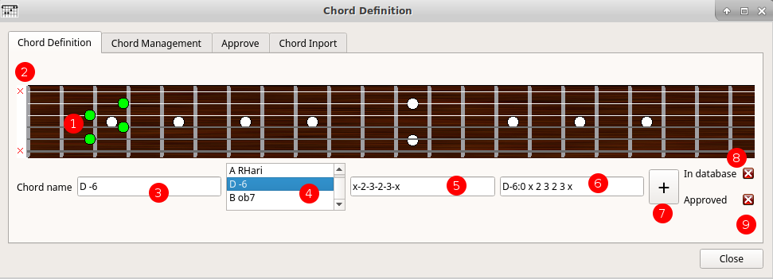

% Chord V user documentation 
% Gilles Maire 
% juin 2018 - Version 0.7

# Introduction

##  A little big story

It is not common to start the documentation of using a
software by a little story.

But ChordV is for people who love the song and in
all the songs there is a story.

I will tell you why I created ChordV.

I realized that my friends guitarists and singers had nostalgia
notebooks that featured on the same page lyrics and chords.
This is the classic mode that suits all fans.

On the other hand, if I have known many songs that I would have liked to gather in
this type of booklets, it turns out that a little over ten years ago I am
produced on small Parisian scenes with my own songs. I have little to
little asked to sing here and there in France and everywhere my little ones
catchphrases. I met quite quickly musicians who asked me
no longer singing books, but chord boxes.

Thirdly, it turns out that when I sing in front of friends, they
I care about the lyrics so I can sing with me. These friends are neither
amateur guitarists or professional guitarists and they do not read
colorful guitar pattern texts.

Finally to finish, I record my discs with Ardor under Linux machine.
I record, I listen to the result, I re-record and sometimes several times.

During the recording days I try several interpretations and at the end
two or three times I do not know if I sang a verse or if it was
in the previous song that I had sung. So I hesitate and that means
on the recordings. So I needed a memory aid mode.

Once I developed the memory aid I recorded, but once I
resumed the recording I had to do a lot of manipulations with the mouse.

That's how I thought of linking Ardor to ChordV so that the lyrics would come back in the beginning
when I ask the recorder to go back to the beginning.

I miss one last point to be complete, I like Open Source, it's my job,
I like to develop. My songs are all open sources in Creative Common, they are delivered
in demonstration of Chord V.

Finally, I could not develop software that does not run on Linux and that is not open source.

I developed ChordV in C ++ with the Qt5 library. It is portable MacOsx, Windows or tablet
Android or Apple, but I do not have time to make the installer for these environments.

It's getting late, I have concerts to honor, they bring me a lot of happiness. I also have
an activity of computer scientist and teacher to continue. I have a family that sees me too often
back writing programs or songs.

It's getting late, I have to let you discover Chord V.

## Chord V presentation

- ChordV allows you to produce different types of PDF files for
list of songs
- ChordV provides:
    - a text editor with syntactic colorization and insertion of
    Tags in cho format
    - an chords manager and a guitar chord basis
    To add or insert chords
    - four processors to generate a book containing the
    Lyrics without the chords, a book with
	Chords and lyrics, a book with chord grids and a lyric monitoring
	solution.
- For each of the modes, the options management makes it possible to
Appropriate settings
   - **Text:** in this mode, the lyrics alone appear, without
   No chord representation
   - **Lyrics:** In this mode, text and chords are displayed.
   - **Chords:** in this mode, chords are not displayed. It is
   Useful for accompanying musicians.
   - **Memory:** in this mode, only the beginning of the text are displayed

- ChordV uses a very efficient and simple tag language Chord Pro:
   
   
~~~
{title:Let it be}

{subtitle: Lyrics ansd music :  Paul McCartney, John Lennon}
{Subtitle: Apple Label}
{columns:1 }
When I  [C] find myself in  [G]  times of trouble
Am Mother  [G] Mary  [F]  comes to me
[C] Speaking words of  [G] wisdom, let it  [F | C/E] be.       [Dm7][C]
And  [C] in my hour of  [G]  darkness
She is  [Am] standing  [G] right in   [F]  front of me
[C] Speaking words of  [G] wisdom, let it  [F | C/E] be.       [Dm7][C]
~~~~

Chord V can use the chord pro file as is, but
by losing the benefit of the rhythmic tracking of the lyrics of the memorization mode.

In ChordV we will tend to indicate whether the chord apply to a measurement
or a rhythm as well:

~~~
{title:Let it be}

{subtitle: Lyrics ansd music :  Paul McCartney, John Lennon}
{Subtitle: Apple Label}
{columns:1 }
When I  [C:2] find myself in  [G:2]  times of trouble
Am Mother  [G:2] Mary  [F:2]  comes to me
~~~~

The notation [C: 2] indicates that the chord of Do is played on half a measure.
See chapter [Time Signature and Tempo](#TimeSignature) for
the details of the times on the chords.

# The edit window

## Presentation

### The Edit Window

1. The edit menu allows you to access the replace functions
and zoom the font. Next to the menu items
keyboard shortcuts.
2. The icons are used to insert the Hedging Notes, the
and all the information that is highlighted in purple in the figure.
3. The text box allows you to enter the songs in
chord pro
4. The log section displays error messages labeled in red
and success messages labeled green.
5. When you select a chord, by pressing the
Mouse up or down you go up or down the duration of a
chord. Thus we pass from [Do#x2] to [Do#] and then to [Do:2] by turning
the wheel to yourself.
6. A table of content browser to go directly on choosen title

### The list of songs 

The list of songs is automatically built, in other words
when you enter a tag '{title: Accroche}' this list is
automatically generated.

By clicking on one of the song titles, you will be directed to the
title of the song in the text.

Two things are noteworthy:

- if you enter the memory help mode via the F8 key you
find this list but we will return to its use (attention
to return to editor mode you will have to go back to editor mode
by the F2 key).
- Note that if you clicked on a title, that title is automatically
selected in the help window.
- The second thing to notice is that the title of the song appears
in the status area at the bottom of the screen. We will come back to it.

## The status bar 

1. The window in which you are can be the text editor, the global definitions, the text mode settings,
the chord mode settings, the chord mode and text settings, and the word monitoring world management
2. The name of the file which appears in green if the file can be modified and in red otherwise
3. The name of the directory which appears in green if the directory can be accessible in writing modified and in red in the opposite case
4. The number of songs contained in the current file
5. The name of the selected song or the song whose selection is retained.
6. A blocking mode to keep the selected song saved, which can be useful if you are working in the lyrics monitoring mode
especially in the case of a recording session where the song will be recorded several times.

# Le menu général 

## Présentation 

The general menu allows you to manage
    - the File menu
    - the Editing submenu
    - the Window submenu
    - the Tools submenu
    - the Help submenu

## The File submenu

By starting to manipulate the different menu items, which are
at least very classical, we can notice that we can open
cho3 files or project files.

Cho3 files are classic chord files, with tags
extended chordV.

Chop files are project files containing
    - an cho3 file included in the file and not a linked file.
    This means that you can copy only the chop file that
    is completely autonomous.
    - Ini format attributes that allow you to save everything
    what you are interested in the layout: color of
    cover, front and back, margins etc ...
    
Currently the standard cho evolves to allow the addition of these
attributes but on the one hand the files quickly become unreadable
the opportunities offered are much more limited than those offered
that offers you chordV.

It is therefore advisable to work with chop files and if you
must give someone who uses chordpro ​​a file that he can
read, just export the file.

Similarly if you find a chorpro file you can import it by
the file menu.

Finally note that at the end of the list of items you can recover
the list of the last 10 open chop files.

## The Edition sub menu

## The View sub menu 

## The tools sub menu 

## The help sub menu

# ChordV tags

## The chord pro tag language

It may be strange that modern software does not
WysiWyg interface, that looks like the output
paper. Actually ChordV takes only one input format and is capable of
to generate a text booklet, a booklet of text and chords, a booklet
with chords grids and memory aid. In what mode
He choose to work? We chose the tag mode that
a pivot format.

In addition this pivot format is written in the chord pro language of the
extensions useful to the program. So you can load in ChordV
all chord pro files available in the resources
music of the net.

## The titles

### Document title

~~~ chord
{covertitle: title}
~~~

Provides the title of the document
Only one title per document is allowed

The abbreviated notation is {ct: title}

### Subtitle of the document

~~~ ChordPro
{coversubtitle: under title}
~~~

Provides the subtitle of the document, ie a text accompanying the title
One subtitle per document

The abbreviated notation is {cs: title}

### Title of a song

~~~
{title: title of the song}
~~~

It's the title of a song. There are as many title headings as songs
in the document. You can only have one title per song. If we define two
consecutive titles one provokes a page break with an empty song for the first.

The abbreviated notation is {t: title}

### Subtitle of a song

~~~
{subtitle: subtitle of a song}
~~~

It's a subtitle, accompanying the song. Several subtitles can be provided
which will be separated by line breaks.

The names of authors, composers or performers can be found in this
category.

The abbreviated notation is {st: title}

## Paging order

### Jumps

~~~
-----
~~~

### Number of columns for the song

~~~
{Columns: 2}
~~~

Sets the number of print columns for the song

### Skip columns

~~~
{Column_break}
~~~

Causes the generation of a new column.

The abbreviated notation is {colb}

### New song

~~~
{New_song}
~~~

Recognized but not used, this tag is for compatibility with
other implementations of forma cho

The abbreviated notation is {ns}

#### Decrease in line spacing

~~~
{Compress}
~~~

If a song does not fit properly in a page, you can activate the mode
compress that will reduce the leading of the song from the moment the argument
is met

## Sections

### Chorus start

~~~
{Start_of_chorus}
~~~

Indicates the beginning of a chorus.

The abbreviated notation is {soc}

### End of the chorus

~~~
{End_of_chorus}
~~~

Indicates the end of the chorus

Abbreviated lantern is {eoc}

### Chorus

~~~
{Refrain}
~~~

Indicates the chorus

## Rhythmic signature and tempo {#SignatureRytmique}

### Notes

These values ​​will be reported in the chord grid mode and widely used in the memory aid mode.

### Tempo

- The tempo will be represented by the beacon

~~~
{Tempo: 12O}
{Tempo: 112.5}
~~~

If the tempo is omitted, the value 120 will be assigned.

The tempo is the number of times per minute. It can include one or more decimals, the decimal separator is the point
whatever the language chosen.

The introduction of a decimal is unusual in conventional musical notation, but some software allows
this extension for example when they deduce the value of the tempo of a piece

### Rhythmic signature

- The rhythmic signature of a song is represented by the tag {time: 4/4}

- If no rhythmic signature is mentioned for a song, the value 4/4 will be assigned

## Chord

### Basic notation

- In English format (if the format is configured in English) we follow the notation ABCDEFG

~~~
[A]
~~~

- In French format (if configured as such), we follow the notation La Si Do Ré Mi Fa Sol

~~~
[La]
~~~

- The minor mode is noted - if the chords are in English and m if they are in French and configured as such
- The mode 7 6 5 13 etc are noted in numbers

### Extended notation

- The bars are noted in Roman numerals with the box of the bar:

~~~
[A(V)]
~~~

- Extention of time

These extensions were introduced by chord V and are being discussed with the authors of the ChordPro format definition

x number indicates the number of measurements of the chord

~~~
[A(V)x3]
~~~

By default an chord without added measure will be considered as an chord of a measure

So [A] will be an chord of a measure

- division of time

: indicates a division of the measure {#TimeSignature}

So for a 4/4 signature measure the ratings:

- [A:2] will mean a measure divided by 2 ie 2 beats
- [A:4] will mean a measure divided by 4 ie 1 time

### Inserting chords into the editor

By double clicking on the text the chord include window you
to select a chord by pressing the Insert button
the chord. This action can also be taken by the support of
the F4 key (while the F3 key is used to enter the
management chord)

You can change the tempo by using the mouse wheel
holding down the SHIFT key in the editor.

# Software preferences

## The general preferences

- Preferences allow you to set options for all
songbooks to allow  a collection of book with the same aspect
- Imagine that you want to build a collection of songs from
Beatle's song, a collection of David Bowie songs and a collection 
of Jango Renhardt chords . For each of these collections, you can choose
You may wish to define the same formats for each of them, or at least 
some common options in fonts characters or other. 
It is in the preferences that you can these global options, even if
they can be adapted to each artists thereafter
- It should be noted that there are shortcuts of preferences called
Preferably gadgets.
   - One allows you to return to the initial choices of the software at
   Cases where your tests are not satisfactory
   - One allows you to set a setting for an artist like the
   Default setting in the future.

## The preferences menu

- Preferences are accessed via the Preferences menu or by the shortcut
Keyboard CTRL + O as shown in the following figure

## General preferences

1. You can choose the language of the software. If your language is not 
in the list, you can make a translation file
(See part # (translation-of-software-in-a-language))
2. Select the measurement system that is most convenient for you
cm, mm and inch
3. ChordV launches a PDF reader when you want to view
the delivered generated by the application. In this area,
the name of the program
4. The name of the booklet author can be entered here. It will be used
in the production of documents.

## The options for each booklet mode

These options are not necessarily exactly the same for each
booklet, indeed in text mode the font of the chords does not exist
since in this mode the chords do not exist. We will
separate the presentation of the common and specific options
in each mode.

There are two tabs, one called Document, and the other one for
each of the

### Common options on the Document tab

1. Width selection area. If you put values ​​here
Corresponding to an existing format, this format will be displayed in the
3.
2. Height selection area. If you put values ​​here
Corresponding to an existing format, this format will be displayed in the
3. This field allows you to choose a PDF format by an IS0 name. Yes
You select a format from this menu, you will see the sizes
Displayed in zones 1 and 2
4. Italian inverses the heights and widths
5. Select the default font for the document. Refer
To the documentation relating to
[Font Selection] (# Font Selection)
6. Select the font for the titles on each page.
If you select a background color (Refer to
To the documentation relating to
[Font Selection] (# font-selection), a color frame
Selected will frame the title over the entire width of the page.
7. Select the subtitle font for each subtitle.
page. If you select a background color (Refer to
To the documentation relating to
[Font Selection] (# font-selection), a color frame
Selected will frame the title over the entire width of the page.
8. Selects 1-sided or 2-sided. If you select the
Duplex mode, page numbers if they are offset to the right
Will be eccentric to the left one page out of two.
9. By specifying the color of the paper, the frame colors of the titles
And subtitles if they are of this color will not be drawn.
This avoids erasing characters that could be set under
the framework.
10. This field is used to number the pages with the number on the right,
Center or left
11. Selects the page numbering style 1, - 1 - or 1 / n
12. This area allows you to choose the typeface of the
Page numbers. If the font color is not the same
To the color of the paper a frame will be drawn around the page number.
13. Sets the horizontal margin
14. Set the vertical margin

### Common options on the Content tab

1. The PDF file includes a cover
2. The font of the cover is positioned
3. The title may be one-third of the height, half or two-thirds
4. Selecting an optional image for Coverage
5. Table of Contents in compressed Mode
6. Number of columns in table of contents
7. Typeface used for table of contents
8. Characters used between the title name and the page in the table
subjects
9. Position of the table of contents at the beginning, at the end of the document or
No table of contents
10. Extension added to the output file
11. Vertical Spacing
12. Opening the PDF in full screen mode
13. Force titles in uppercase

### Memory mode preferences

1. Allows you to select the font and its color
and the background color as it appears in zone 5
2. Indicates whether the monitoring window will be at the top of the screen,
in the middle or on the right. If the full screen mode is selected this mode
will no longer be accessible. This mode is for the recording mode of a
song when the singer wants to follow the progress of his recording
on his recording software
3. Full-screen mode rather intended for karaoke, although we can project
a video and or images while the music is activated with the mode
picture at the bottom of the screen.
4. Two lines are displayed, the brighter line on lyrics in
course and the darker line on the following lyrics. If this mode
is not selected, only one line is displayed.
5. Rendering of the font
6. Each time is materialized by the display of a red bubble for
the first time and a green bubble for other times.
7. An audible click is activated on each beat
8. Click Volume Adjustment
9. The first sound time is more marked than the other times
10. Advance Display, Set Time Display Advance
on the lyrics to allow the singer to read slightly in advance
11. Number of measurements before starting the recording.

## Conventions

### Select fonts

Select fonts to select the font family
Its size, its style and all the traditional options
To which are added:
    - the background color
    - the color of the font
Selecting a color will change the color of the button to
Show you the color it contains
An explanation of background color is required.

## Inserting chords in the editor

By double clicking on the text the chord inclusion window you
allows you to select a chord by pressing the insert button
the chord. This action may also be supported by the
the F4 key (while the F3 key is used to enter the
Management of chords)

You can change the tempo by using the mouse wheel
by holding down the SHIFT key in the editor.

## Chords definition

### Presentation

The chord definition window is divided into four tabs:
- The definition of the chord which makes it possible to reach chord
the position of the fingers on the handle
- A chord management module allowing visualization,
amendment or deletion of each chord
- A module to approve each unapproved chord
- A module for importing a list of accretions contained in a
text file

### Defining an chord

1. Select the boxes on the handle
2. selection of the empty strings with a round not played with a cross
3. Name of the chosen chord
4. Selecting the choice between several possible tuning names
5. Notation boxes
6. Resulting notation in the define
7. Adding the chord to the database
8. Green if chord is known in the database
9. Green if chordis approved

### Managing chords

1. This selector lets you choose a chord, you can also
Restrict or order the list of chords using filters
3 and 2
2. chords may be sorted according to the name of the chord, the number
Fret or index that is the order number of the chord in the database.
3. The filter makes it possible to restrict the chords presented by choosing
The first letters of the chord in the English language. The Little Cross
Next to the edit line allows to erase the name of the fugating chord
In the filter.
4. Display of the name of the chord, if this name is modified it can be
saved. But be careful the name of the deal must be unique. We
Will distinguish two chord names by the use of parentheses with
For example a notation in Roman numerals of the fret.
5. Chord finger display. This fingering can be changed.
6. Button to delete the chord
7. Button to modify the current chord with the values
Entries in boxes 4 and 5
8. Display of the chord.

### chord approval mode

Chords can be defined in the song files by
Example by Directive

~~~
{Define: Eb95 base-freight 5 frets 5 6 6 5 6 x}
~~~

Such a chord is automatically included in the database, but
It will be necessary to approve it so that it is
operational.

1. This selector lets you choose a chord
2. The box shows the name of the chord. You can copy this name
But not modify it
3. The box shows the fingering of the chord that can be copied but not
amended.
4. The chord may be deleted from the base, in which case the
Deleted from the song file, otherwise it will be inserted again.
5. The chord may be accepted in the database
6. This area allows you to view the chord.

### Importing chords

1. By copying a chord list, with one chord per row,
You can import the database. chords should be
Be in the form Name = freight
2. The button will request the actual import

## Conversions

### Chord conversions on 2 lines to chordpro

### Change the chord language.

### Transposer les accords

1. The wheel has the same action as the input zone 2, it allows to define
the number of positive or negative semitones you want to transpose the chord.
2. The input area allows you to define the number of positive or negative semitones 
you want to transpose the chord.
3. You can transpose the chord onto the chord under the mouse,
all of the current line, the current song or the whole file
4. Close the dialog box
5. Transpose the chord

1. Choisir la langue d'origine ( en général elle est positionnée
automatiquement)
2. Choisir la lettre pour signifier que l'accord dans la langue 
d'origine est mineur
3. Choisir la langue vers laquelle on souhaite convertir les noms d'accord
4. Choisir la lettre pour signifier que l'accord dans la langue à convertir
est mineur
5. Cliquer sur convertir

## Display PDF

ChordV launches the PDF viewer that you have positioned in the preferences

This option is available in the tools menu

## Build PDF

The construction of a PDF file is almost instantaneous. She is
integrated into the software.

This option is available in the tools menu

## Build and display PDF

This mode builds a PDF file and starts its display.

This option is available in the tools menu

# Memory mode or lyrics monitoring

## Presentation

This mode allows you to display the lyrics that appear by scrolling following
the speed of the song. The refrains are reinserted between each verse.
It is necessary for this world to work precisely that:
1. Chords are entered with notation [Dox2] for example explaining
although the chord is done on two measures
2. The tempo is suitably defined for the song via the tag
{tempo: xxx}, if not set, the value of 120 beats per second will be assigned to the tempo
The tempo tag accepts the decimal value where the point is the value separator
decimal regardless of the language.
3. The time signature is entered via the tag {time: xxx}. If the signature is not
set the value 4/4 is initialized.

Finally we must keep in mind that the memory help mode can be clocked
via the transport jack. So if you record with Ardour, triggering playback
or recording in Ardour, scrolling will begin automatically.

## Memory mode définition

1. Allows you to select the font and its color
and the background color as it appears in zone 5
2. Indicates whether the monitoring window will be at the top of the screen,
in the middle or on the right. If the full screen mode is selected this mode
will no longer be accessible. This mode is for the recording mode of a
song when the singer wants to follow the progress of his recording
on his recording software
3. Full-screen mode rather intended for karaoke, although we can project
a video and or images while the music is activated with the mode
picture at the bottom of the screen.
4. Two lines are displayed, the brighter line on lyrics in
course and the darker line on the following lyrics. If this mode
is not selected, only one line is displayed.
5. Rendering of the font
6. Each time is materialized by the display of a red bubble for
the first time and a green bubble for other times.
7. An audible click is activated on each beat
8. Click Volume Adjustment
9. The first sound time is more marked than the other times
10. Advance Display, Set Time Display Advance
on the lyrics to allow the singer to read slightly in advance
11. Number of measurements before starting the recording.

# Technical part

## Keyboard shortcuts - Mouse actions

### Keyboard shortcuts

------------------------------------------------------------
 Shortcuts    Action            Shortcut     Action
------------ --------------- ------------ ------------------ 
  CTRL + F    Search              F1          Documentation
  
  CTRL + O    Preferences         F2          Text Edition mode
  
  CTRL + R     Replace            F3          Define chords
  
  CTRL + S     Save               F4          Insert chord
  
  CTRL + +     Zoom +             F5          Produce PDF  in text mode
  
  CTRL + -     Zomr -             F6          Produce PDF in text and lyrics mode
  
                                  F7          Produce PDF in grid mode

                                  F8          Memory Mode

                                  F10         Launch memory mode action
  
-------------------------------------------------- -----------
: Keyboard shortcuts

## Translation of the software into a language

### Presentation

- You do not need the source codes to translate the software.
- If you go to the system menu of the application, you
Find the path of the configuration file for example:

~~~ bash
/home/gilles/.config/ChordV/ChordV.conf
~~~
- in the /home/gilles/.config/ChordV/ directory are the files
languages ​​in the Languages ​​containing languages
written with the name in the translated language. For French it will be found
whe name with the cedille exactly as a French could read it.
- Inside the French repertory there are three files
    - fr.png: this file is a flag of the language in png format
    - fr.ts: this file is the file containing the translation pairs
    - fr.qm: this file contains the compiled ts file
    - fr.html : the documentation of software translated

### Translation of the file fr.ts

- Create a language directory with the name for example Español
- Copy the file fr.png to es.pgn
- You can download the linguist program and open the file fr.png
- In linguist save the es.ts file and activate the menu
File / Publish ts.qm will be created
- Do not forget to write to the author of the software to
Es.ts file so that it is included in the next software distribution

## Batch mode and graphic mode

- Without any argument chordV is launched with a GUI
- With the -t chordV argument does not start the GUI and
will produce the PDFs for the default configuration
- You can also run chordV with a file.chop argument
to open it automatically at startup.

## Documentation of Chord V

## Presentation

The documentation is accessible in the software via the help menu
To the Documentation item.

This documentation has been automatically
From the Markdown to HTML format via the Pandoc program.

The documentation file is located in the directory cited part
[Translation of the software into a language] (# translation-of-software-in-a-language)

### Translation Process

If you wish to translate the software documentation, you must
The md file in the desired language, convert it via a translator
Automatic and correct it.

Beware because the translator tends to transform the codes
Md style

~~~ md
! [The editing window] (./img/ editor.png)
~~~

in

~~~ md
! [The editing window] (./img/editor.png)
~~~

Once the file is translated, you can convert it to html format
Via the command (after retrieving the css style sheet on
the Internet)

~~~ bash
Pandoc --toc --ascii --smart -N --css = pandoc.css --from = markdown --to = html --output = es.html es.md
~~~

### Images

The images are to be included in the img directory of the / es languages ​​directory,
They come from screenshots. If you use gimp you can use
The plugin drawnumbers which allows to produce the red pellets.

It is available at
[Draw-number] (xhttp: //www.gillesmaire.com/tiki-index.php page = draw-numbers?)

## Compatibility Chordpro

### Introduction

Chord V is designed to produce 4 types of documents at the same time
and some chord pro tags are designed for a single use. So we
do not want to output the same format for each of the
documents, knowing that the booklets of words are perhaps intended
to a printed file and the tuning grid files may be
be for PDF files for a reader or tablet.

Chord reads Chordpro ​​files and knows how to extract
ChordPro compatible file.

Some tags are not used because replaced by the graphical interface.

### Compatibility ChordPro 2ii

-----------------------	    ----------------------
ChordPro 2ii                           Chord V
--------------------    	------------------
{New_song} {ns} 				Read but replaced by title

{Title} {t} 								X

{Subtitle} {st} 							X

{Comment: text} {c: text} 					X

{Comment_italic: text} {ci: text} 			X

{Comment_box: text} {cb: text} 				X

{Start_of_chorus} {soc} 					X

{End_of_chorus} {eoc} 						X

{Start_of_tab} {sot} 						nO

{End_of_tab} {eot} 						nO

{Define ...} biEntot

{Textfont: fontname} {tf: fontname} 	Graphical interface

{Textsize: fontsize} {ts: fontsize} 	graphic interface

{Chordfont: fontname} {cf: fontname} 	Graphical interface

{Chordsize: fontsize} {cs: fontsize} 	graphic interface

{No_grid} {ng}							 nO

{Grid} {g} 								 nO

{Titles: flush} 						nO

{New_page} {np} 					   ASAP

{New_physical_page} {npp} 				nO

{Columns: number} {col: number} 	    X

{Column_break} {colb}                   X

{Pageize: type} {papersize: type}  	Graphical interface

-------------------------------------------------- ----------------------
:: List of commands chordpro ​​2ii
