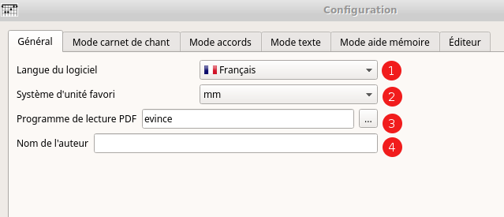
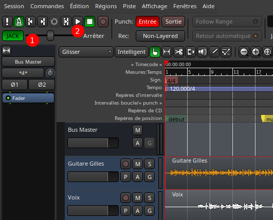

% Documentation utilisateur de Chord V
% Gilles Maire 
% Juin 2018 Version 0.8

# Introduction 

## Une petite histoire

Il n'est pas courant de commencer la documentation d'utilisation d'un
logiciel par une petite histoire.

Mais ChordV est destiné aux personnes qui aiment la chanson et dans
toutes les chansons il y a une histoire.

Je vais ainsi vous raconter pourquoi j'ai créé ChordV.

Je me suis rendu compte que mes amis guitaristes et chanteurs avaient
la nostalgie des carnets de chant qui présentaient sur la même page les
paroles et les accords.

C'est le mode classique qui convient bien à tous les amateurs.

Par contre, si j'ai connu beaucoup de chansons que j'aurais voulu
rassembler dans ce type de  livrets, il se trouve qu'il y a un peu plus
de dix ans, je me suis produit sur de petites scènes parisiennes avec
des propres chansons. On m'a peu à peu demandé d'aller chanter ici ou
là en France et un peu partout mes petites rengaines. J'ai rencontré
assez rapidement des musiciens qui ont eu la gentillesse de 
m'accompgner qui me demandaient non plus des carnets de chant, 
mais des grilles d'accord.

En troisième lieu, il se trouve que lorsque que je chante devant des
amis, ils me demandent les paroles pour pouvoir chanter avec moi. 
Ces amis ne sont ni guitaristes amateurs ni guitaristes professionnels
et ils n'aiment pas lire des textes bariolés de schéma de guitare.

Enfin pour finir, j'enregistre mes disques avec Ardour sous machine
Linux. J'enregistre, j'écoute le résultat, je réenregistre et parfois
plusieurs fois de suite.

Lors des journées d'enregistrement j'essaie plusieurs interprétations
et au bout de deux ou trois fois je ne sais plus si j'ai chanté un
couplet ou si c'était dans la chanson précédente que je l'avais chanté. 
Alors j'hésite et cela s'entend sur les enregistrements. Il me fallait
donc un mode aide mémoire.

Une fois que j'ai développé l'aide mémoire et que  j'ai enregistré,
j'ai remarqué qu'une fois que je reprenais l'enregistrement je devais
faire beaucoup de manipulations à la souris. 

C'est ainsi que j'ai pensé lier Ardour à ChordV pour que les paroles 
reviennent au début lorsque je demande à l'enregistreur de revenir au
début.

Il me manque un dernier point pour être complet, j'aime l'Open Source, 
c'est ma philosophie de vie et mon métier, j'aime développer. 
Mes chansons sont toutes Open Sources en Creative Common, elles sont
livrées en démonstration de Chord V.

Pour finir, je ne pouvais pas développer un logiciel qui ne fonctionne 
pas sous Linux et qui ne soit pas Open Source.

J'ai développé ChordV en C++ avec la librairie Qt5. Il est donc
portable sour MacOsx, Windows ou sur tablette
Android ou Apple, mais je n'ai pas le temps de fabriquer l'installeur
pour ces environnements.

Il se fait tard, j'ai des concerts à honorer, ils m'apportent beaucoup
de bonheur. J'ai aussi une activité d'informaticien et d'enseignant
à continuer. J'ai une famille qui me voit trop souvent de
dos en train d'écire des programmes ou des chansons.

Il se fait tard, il faut que je vous laisse découvrir Chord V.

## Présentation du logiciel

ChordV permet de produire différents types de fichiers PDF représentant
une collection de  chansons
ChordV fournit ainsi :

- un éditeur de texte avec colorisation syntaxique et insertion des 
	balises au format chord pro étendu
- un gestionnaire d'accords et d'une base d'accords guitare 
    permettant d'ajouter ou d'insérer les accords
- quatre processeurs permettant de générer
	    1. un livre contenant les paroles sans les accords ;
		2. un livre contenant  accords et paroles ;
		3. un livre contenant uniquement les grilles d'accords ;
		4. un mode défilement des paroles avec possibilité de
		synchronisation avec tout logiciel de lecture ou d'écriture
		compatible jack.

Pour chacun de ces modes la gestion des écran de configuration permet
de faire les réglages précis des différentes options de sortie :

- **Texte :** dans ce mode, les paroles seules apparaissent, sans 
   aucune représentation d'accord. Ceci engendre des choix de police
   de caractères, de marges, de taille de page etc..
- **Lyrics :** dans ce mode, le texte et les accords sont affichés, avec
   les même choix que ceux précédemment évoqués.
- **Accords :** dans ce mode, les accords ne sont affichés. Il est 
   utile pour les musiciens d'accompagnement, avec
   les même choix que ceux précédemment évoqués.
- **Mémoire :** dans ce mode, un monitoring des paroles est proposé
   pour permettre le suivi des paroles. Des options de position de
   fenêtre de monitoring jusqu'au temps mort avant début du morceau
   sont proposées.

ChordV utilise le langage de balises très efficace et simple de Chord
Pro dont certaines balises sont étendues.

Voici pour mémoire un exemple de fichier chord pro :

~~~
{title:Let it be}

{subtitle: Lyrics ansd music :  Paul McCartney, John Lennon}
{Subtitle: Apple Label}
{columns:1 }
When I  [C] find myself in  [G]  times of trouble
Am Mother  [G] Mary  [F]  comes to me
[C] Speaking words of  [G] wisdom, let it  [F | C/E] be.       [Dm7][C]
And  [C] in my hour of  [G]  darkness
She is  [Am] standing  [G] right in   [F]  front of me
[C] Speaking words of  [G] wisdom, let it  [F | C/E] be.       [Dm7][C]
~~~~

Chord V peut utiliser le fichier chord pro tel quel mais
en perdant le bénéfice du suivi rythmique des paroles du mode
mémorisation.

En ChordV on aura plutôt tendance à indiquer si les accords s'appliquent
à une mesure ou un rythme ainsi :

~~~
{title:Let it be}

{subtitle: Lyrics ansd music :  Paul McCartney, John Lennon}
{Subtitle: Apple Label}
{columns:1 }
When I  [C:2] find myself in  [G:2]  times of trouble
Am Mother  [G:2] Mary  [F:2]  comes to me
~~~~

La notation [C:2] indique que l'accord de Do est joué sur une demi
mesure.
Se reporter au chapitre
[Signature rythmique et tempo](#SignatureRytmique) pour les détails des
temps sur les accords.

# La fenêtre d'édition

## L'éditeur

1. Le menu édition permet d'accéder aux fonctions rechercher remplacer
et de zoomer la police de caractères. En regard les items du menu vous
disposez de raccourcis clavier.
2. Les icones permettent d'insérer les Titres de couverture, les mesures
et toutes les informations qui sont surlignées en violet sur la figure.
3. La zone de texte vous permet d'éditer texte et accords les chansons
au format chord pro
4. La partie log affiche des messages d'erreur étiquetés en rouge
et des messages de succès étiquetés en vert.
5. Quand vous sélectionner un accord, en actionnant la molette de la
souris vers le haut ou le bas vous montez ou descendez la durée d'un
accord. Ainsi on passe du [Do#x2] au [Do#] puis au [Do:2] en tournant
la molette vers soi.
6. Un navigateur table des matières permet de se rendre directement à
la chanson désirée

## La liste des chansons automatique

La liste des chansons est automatiquement construite, autrement dit 
lorsque vous entrez une balise '{title:Accroche}' cette liste est 
automatiquement générée. 

En cliquant sur l'un des titres de chanson, vous serez dirigé sur le 
titre de la chanson dans le texte.

Deux choses sont à remarquer : 

- si vous entrez dans le mode aide mémoire via la touche F8 vous 
retrouverez cette liste mais nous reviendrons à son utilisation
(attention pour revenir au mode éditeur vous devrez revenir dans le mode
éditeur  par la touche F2).
- Notez que si vous avez cliqué sur un titre, ce titre est
automatiquement sélectionné dans la fenêtre aide mémoire. 
- La deuxième chose à remarquer c'est que le titre de la chanson
apparaît dans la zone de status en bas de l'écran. Nous y reviendrons. 

## La barre des status

La barre des status présente les informations suivantes :

1. La fenêtre dans laquelle on se trouve peut être l'éditeur de texte,
les définitions globales, les réglages du mode texte, les réglages du
mode accord, les réglages du mode accord et texte et la gestion du
monde monitoring des paroles
2. Le nom du fichier qui apparait en vert si le fichier peut être
modifié et en rouge dans le cas contraire
3. Le nom du répertoire qui apparait en vert si le répertoire peut être
accessible en écriture modifié et en rouge dans le cas contraire
4. Le nombre de chansons contenues du fichier courant
5. Le nom de la chanson sélectionnée ou la chanson dont la sélection
est conservée.
6. Un mode de blocage permettant de garder la chanson sélectionnée
sauvegardée, ce qui peut s'avérer utile si on travaille en mode
monitoring des paroles notamment dans le cas d'une séance
d'enregistrements où la chanson sera enregistrée plusieurs fois.

# Le menu général 

## Présentation 

Le menu général permet de gérer 

- le sous menu Fichier
- le sous menu Édition 
- le sous menu fenêtre
- le sous menu Outils
- le sous menu Aide
    
## Le sous menu Fichier

En commençant à manipuler les différents item du menu, qui sont  
pour le moins très classique, on remarquer qu'on peut ouvrir des
fichiers cho3 ou des fichiers projet.

Les fichiers cho3 sont des fichiers chord classiques, avec les balises
étendues chordV. 

Les fichiers chop sont des fichiers projet contenant 

- un fichier cho3 inclu dans le fichier et on pas un fichier lié. 
Cela veut dire que vous pouvez copier uniquement le fichier chop qui
est tout à fait autonome.
- des attributs au format ini qui permettent de sauvegarder tout
ce qui vous intéresse quant à la mise en page : couleur des 
couverture, recto verso, marges etc ...
    
Actuellement la norme cho évolue pour permettre l'adjonction de ces
attributs mais d'une part les fichiers deviennent vite illisibles 
d'autre part les possibilités offertes sont beaucoup plus limitée que
celles que vous offre chordV.

Il est donc conseillé de travailler avec des fichiers chop et si vous 
devez donner à quelqu'un qui utilise chordpro un fichier qu'il pourra
lire, il vous suffit d'exporter le fichier. 

De même si vous trouvez un fichier chorpro vous pouvez l'importer par 
le menu fichier. 

Enfin notez qu'à la fin des la liste des items vous pouvez récupérer
la liste des 10 derniers fichiers chop ouverts.

## Le sous menu Édition

Le sous menu d'édition est classiquement équipé d'un menu de recherche,
recherche remplace et changement de la taille des polices.

Les traditionnelles opton Copier, Couper et Coller sont naturellement
disponibles pour copier, couper et coller du texte.

## Le sous menu fenêtre

Le sous menu fenêtre présente les différentes fenêtres accessibles :

- La fenêtre d'édition permet d'entrer le texte des chansons ainsi que 
les accords et les différentes balises de réglage
- La fenêtre des définitions globales qui permet de régler différentes 
options comme un texte en filigrane qui vient s'afficher en travers des 
pages de chaque carnet.
- La fenêtre de définition du carnet de chanson textes
- La fenêtre de définition du carnet de chanson textes et accords
- La fenêtre de définition du carnet de grilles d'accords
- La fenêtre permettant de lancer le mode aide mémoire 

Les fenêtres de définition des carnet de chanson textes, textes et
accords et grilles se ressemblent et sont en tout point identiques
à leur définition par défaut accessible dans le menu des préférences.

Ainsi vous pouvez choisir les options par défaut qui vous seront
présentées pour chacun de vos carnets de chanson dans les préférences
et les affiner dans l'une des fenêtres.

La fenêtre de définition de l'aide mémoire est la même que la fenêtre 
définie dans les préférences mais ses fonctionalités sont différentes
le mode aide mémoire présente les textes à l'écran et non plus dans 
des documents PDF. Ainsi les problématiques adressées sont davantage
plein écran, fenêtre en bas ou en haut que le mode recto verso.

Le détail de chacunes de ces feneêtres est explicité dans la partie 
[Préférences et réglages](#PreferencesReglages)  !

## Le sous menu Outils

Le sous menu Outils comprends un certain nombres d'actions que l'on
peut effectuer sur ChordV.

Le premier item concerne les Préférences que sont présentées dans le
chapitre [Préférences et réglages](#PreferencesReglages)

Les gadgets de préférence permettent 

## Le sous menu Aide

Le sous menu Aide présente quatre options :

- une rubrique Documentation
- une rubrique A Propos
- une rubrique Informations systèmes
- une rubrique Charger le fichier de démonstration

### La Documentation

La documentation au format HTML est présentée dans une fenêtre de 
dialogue. Peut être que vous lisez la présente documentation via cette
rubrique dans le logiciel ChordV ou peut être la lisez vous via un 
navigateur Web car le documention est également disponible sur Internet,
enfin peut être lisez vous encore la documentation au format PDF.

En effet la documentation originelle a été conçue dans un format texte
qui permet sa génération en Word, en Libre Office, en PDF, en 
PostScript, en HTML, en Epub et bien d'autres formats.

### A propos

Cette rubrique fournit un certain nombre d'informations sur le
concepteur et les divers outils de conception. Ce produit étant libre,
il a été conçu avec des outils libres qui sont mentionés ici.

### Informations systèmes

On trouve ici les informations systèmes utiles aux développeurs en cas
de problème de fonctionnement de chordV :

- le nom du programme tel qu'il existe sur votre disque
- les arguments avec lesquels le programme a été appelé
- l'emplacement du programme sur votre disque
- le répertoire où sont chargés les fichiers de traductions vous 
permettant de l'utiliser dans votre langue
- la version du programme
- le numéro de version git qui permet de retrouver les codes sources 
de la version de votre programme
- la date de compilation du programme
- le nom et l'emplacement du fichier de configuration du programme
chordV
- le nom de la base de données Sqlite3 où sont rangés les accords

### Charger le fichier de démonstration

Ce fichier de démonstration est inclus dans le programme au format
chordV afin de vous montrer un fichier en cas réel d'utilisation
il contient des chansons du groupe des Jetés de l'Encre.

Ces chansons en langue françaises ont été écrites par Gilles Maire
le concepteur du programme chordV.

Si vous voulez entendre les Jetés de l'Encre en concert, vous pouvez
vous rendre sur le site http://www.lesjetesdelencre.com pour : 
- connaître les dates des concerts
- sur le site vous retrouverez les différents livrets de chansons
produits par chordV.

	
# Les balises de ChordV

## Le langage à balise de chord pro

On peut trouver étrange qu'un logiciel moderne ne présente pas une
interface Wysiwyg, c'est à dire dont l'aspect ressemble à la sortie
papier. En fait ChordV prend un seul format d'entrée et il est capable
de générer un livret de texte, un livret de texte et accords, un livret
de grille d'accords et  un mode aide mémoire. Dans quel mode fallait
il choisir de travailler ? Nous avons choisi le mode à balise qui nous
semblé un format pivot.

En plus ce format pivot est écrit dans le langage chord pro plus des
extensions utiles au programme. Ainsi vous pourrez charger dans ChordV
l'ensemble des fichiers chord pro disponibles dans les resources
musicales libres du net.

## Les titres

### Titre du document

~~~chord
{covertitle: titre }
~~~

Fournit le titre du document
Un seul titre par document est admis

La notation abrégée est {ct: titre }

### Sous titre du document

~~~chordpro
{coversubtitle: sous titre}
~~~

Fournit le sous titre du document, c'est à dire un texte accompagnant
le titre.

Un seul sous titre par document

La notation abrégée est {cs: titre }

### Titre d'une chanson

~~~
{title: titre de la chanson}
~~~

C'est le titre d'une chanson. On trouve autant de rubriques title que
de chansons dans le document. On ne peut avoir qu'un seul titre par 
chanson. Si on définit deux titres consécutif on provoque un saut de 
page avec une chanson vide pour la première.

La notation abrégée est {t: titre }

### Sous titre d'une chanson

~~~
{subtitle: sous titre d'une chanson }
~~~

C'est un sous titre, accompagnant la chanson. On peut fournir plusieurs
sous titres qui seront séparés par des sauts de ligne.

On peut trouver les noms des auteurs, des compositeurs ou des 
interprètes dans cette catégorie.

La notation abrégée est {st: titre }

## Ordre de pagination

### Sauts

~~~
-----
~~~

### Nombre de colonnes pour la chanson

~~~
{columns:2}
~~~

Permet de définir le nombre de colonnes d'impression de la chanson

#### Saut de colonnes

~~~
{column_break}
~~~

Provoque la génération d'une nouvelle colonne.

La notation abrégée est {colb}

### Nouvelle chanson

~~~
{new_song}
~~~

Reconnu mais pas utilisé, cette balise sert pour la compatibilité avec
d'autres implémentations du forma cho

La notation abrégée est {ns}

### Diminution de l'interlignage

~~~
{compress}
~~~

Si une chanson ne rentre pas tout à fait dans une page, on peut 
activer le mode compress qui réduira l'interlignage de la chanson 
à partir du moment ou l'argument est rencontré

## Sections

### Début de chorus

~~~
{start_of_chorus}
~~~

Indique le début d'un chorus.

La notation abrégée est {soc}

### Fin du chorus

~~~
{end_of_chorus}
~~~

Indique la fin du chorus

Lanotation abrégée est {eoc}

### Refrain

~~~
{Refrain}
~~~

Indique le refrain

## Signature rytmique et tempo {#SignatureRytmique}

### Remarques

Ces valeurs seront reportées dans le mode grille d'accord et largement
 utilisées dans le mode aide mémoire.

### Tempo

- Le tempo sera représenté par la balise

~~~
{tempo:12O}
{tempo:112.5}
~~~

Si le tempo est ommis, la valeur 120 sera assignée.

Le tempo inidique le nombre de temps par minute. Il peut comprendre une
ou plusieurs décimales, le séparateur de décimale est le point quelle
que soit la langue choisie.

L'introduction d'une décimale est peu usuelle dans la notation musicale
conventionnelle, mais certains logiciels permettent
cette extension par exemple lorsqu'ils déduisent la valeur du tempo
d'un morceau

### Signature rythmique

- La signature rythmique d'un morceau est représenté par la balise 
{time:4/4}

- Si aucune signature rythmique n'est mentionné pour un morceau, la 
valeur 4/4 sera assignée

## Les accords

### Notation de base

- En format anglais (si le format est configuré en anglais) on suit la
notation ABCDEFG

~~~
[A]
~~~

- En format français (s'il est configuré comme tel), on suit la notation
La Si Do Ré Mi Fa Sol

~~~
[La]
~~~

- Le mode mineur est noté - si les accords sont en anglais et m s'ils
sont en français et configuré comme tel
- Les mode 7 6 5 13 etc sont noté en chiffre

### Notation étendue

- Les barrés son notés en chiffre romain avec la case du barré  :

~~~
[La(V)]
~~~

Ces extensions ont été introduites par chord V et sont en cours de 
discution avec les auteurs de la définition du format ChordPro

- les extentions de temps

x numéro indique le nombre de mesures de l'accord

~~~
[La(V)x3]
~~~

Par défaut un accord sans adjonction mesure sera considéré comme un
accord d'une mesure

Ainsi [La] sera un accord d'une mesure

- division de temps

: indique une division de la mesure

Ainsi pour une mesure de signature 4/4 les notations :

- [La:2] signifiera une mesure divisée par 2 c'est à dire 2 temps
- [La:4] signifiera une mesure divisée par 4 c'est à dire 1 temps

### Insertion des accords dans l'éditeur

En double cliquant sur le texte la fenêtre d'inclusion d'accord vous
permet de sélectionner un accord par l'appui sur le bouton Inserer
l'accord. Cette action peut également être optenue par l'appui de
la touche F4 (alors que la touche F3 permet d'entrer dans le mode
de gestion des accords)

Vous pouvez modifier le tempo par l'emploi de la molette de la souris
en maintenant la touche SHIFT appuyée dans l'éditeur.

# Préférences et réglages du logiciel {#PreferencesReglages}

## De l'utilité des préférences

- Les préférences permettent de définir les options pour tous les 
recueils de chanson afin de rendre homogène une collection de recueils.
- Imaginons que vous souhaitiez construire un recueil des chansons de 
Brassens, un recueil des chansons de Renaud et un recueil des chansons
de Jeanne Chéral. Pour chacun de ces recueils, vous pourrez choisir 
les différentes types de sortie que vous souhaitez et définir à votre
guise chaque sortie, mais vous pouvez vouloir définir les mêmes 
formats pour chacun d'eux, ou au moins quelques options communes dans 
les polices de caractères ou autre. C'est dans les préférences que vous 
pourrez  régler ces options globales, quitte à pouvoir les adapter à
chacun des artistes par la suite.
- Il faut noter qu'il existe des raccourcis de préférences appelés 
gadgets de préférence.
   - L'un vous permet de revenir aux choix initiaux du logiciels au 
   cas où vos essais ne seraient pas satisfaisants
   - L'un vous permet de définir un réglage pour un artiste comme le 
   réglage par défaut dans l'avenir.

## Le menu des préférences

- On accède aux préférences par le menu Préférence ou par le racourci 
clavier CTRL + O comme le montre la figure suivante

## Les options générales des préférences

1. Vous pouvez choisir la langue du logiciel. Si votre langue de figure
pas dans la liste, vous pouvez fabriquer un fichier de traduction
(voir la partie [traduction](#Traduction) )
2. Sélectionner le système de mesure qui vous convient le mieux entre 
cm, mm et pouce
3. ChordV lance un lecteur PDF quand vous voulez visualiser 
le livret généré par l'application. Il faut renseigner dans cette zone
le nom du programme de visualisation en PDF.
4. Le nom de l'auteur du livret peut-être entré ici. Il sera utilisé
dans la production des documents.

## Les options de chaque mode de livret

Ces options ne sont pas forcéments exactement les mêmes pour chaque 
livret, en effet en mode texte la police des accords n'existe pas 
puisque dans ce mode les accords n'existent pas. Nous allons 
séparer la présentation des options communes et celles spécifiques 
à chaque mode.

On trouve deux onglets l'un appelé *Document* et l'autre *Contenu* pour
chacun des modes de sortie. Certaines des options de ces modes sont
communs à plusieurs modes d'autre sont spécifiques.

### Les options communes de l'onglet Document

 

1. Zone de sélection de la largeur. Si vous mettez ici des valeurs 
correspondants à un format existant, ce format sera affiché dans la
zone 3.
2. Zone de sélection de la hauteur. Si vous mettez ici des valeurs 
correspondants à un format existant, ce format sera affiché dans la zone
3. Cette zone permet de choisir un format de page par un nom IS0. Si
vous sélectionnez un format par ce menu, vous verrez les tailles
correspondantes s'afficher dans les zones 1 et 2
4. A l'italienne inverse les hauteurs et les largeurs
5. Permet de sélectionner la police par défaut du document. Se référer
à la documentation relative à la 
[Sélection des polices](#SelectionPolice)
6. Permet de sélectionner la police relative aux titres de chaque page.
Si vous sélectionnez une couleur de fond, un cadre de la couleur
sélectionnée encadrera le titre sur toute la largeur de la page.
7. Permet de sélectionner la police relative aux sous titres de chaque 
page. Si vous sélectionnez une couleur de fond , un cadre de la couleur
sélectionnée encadrera le titre sur toute la largeur de la page.
8. Sélectionne le mode recto ou recto verso. Si vous sélectionnez le
mode recto verso, les numéros de pages s'ils sont excentrés à droite
seront excentrés à gauche une page sur deux.
9. En indiquant la couleur du papier, les couleurs de cadre des titres
et des sous titres s'ils sont de cette couleur ne seront pas dessinés.
Cela évite un effacement des caractères qui pourraient setrouver sous 
le cadre.
10. Cette zone permet de numéroter les pages avec le numéro à droite, 
au centre ou à gauche
11. Permet de choisir le style de numérotation de page 1, - 1 - ou 1/n
12. Cette zone vous permet de choisir la police de caractères des 
numéros de page. Si la la couleur de font de page n'est pas identique 
à la couleur du papier un cadre sera dessiné autour du numéro de page.
13. Permet de définir la marge horizontale
14. Permet de définir la marge verticale

### Les options communes de l'onglet Contenu 

1. Le fichier PDF comporte une couverture
2. La police de caractères de la couverture est positionnée 
3. Le titre peut être au tiers de la hauteur, à la moitié ou au 2/3
4. Sélection d'une image optionnelle pour la couverture
5. Mode compression de la table des matières activé
6. Nombre de colonnes de la table des matières
7. Police de caractères uitilisée pour la table des matières
8. Caratères utilisés entre le nom du titre et la page dans la table
des matières
9. Position de la table des matières, au début, à la fin du document ou 
pas de table des matières
10. Extension ajoutée au fichier de sortie
11. Espacement vertical 
12. Ouverture du PDF en mode plein écran
13. Forcer les titres en majuscule

### Les préférences du mode mémoire

Le mode aide mémoire ou monitoring des paroles permet d'afficher 
les paroles en suivant les informations du fichier de chanson, notamment

- les balises {tempo:xx} qui donnent le tempo de chaque chanson. Si 
la balise tempo est absente d'un morceau, elle sera arbritrairement
forcée à la valeur 120
- à la balise time de la forme x/y qui indique le nombre de temps de
chaque mesure. Si cette balise est absente, elle sera arbitrairement 
forcée à la valeur 4/4

Voici la liste des options numérotées :

1. Permet de sélectionner la police de caractères ainsi que sa couleur 
et la couleur du fond telle qu'elle apparait dans la zone 5
2. Permet d'indiquer si la fenêtre de monitoring sera en haut de
l'écran,au milieu ou à droite. Si le mode plein écran est sélectionné ce
mode ne sera plus accessible. Ce mode est destiné au mode enregistrement
d'une chanson quand le chanteur veut suivre la progresssion de son
enregistrement sur son logiciel d'enregistrement
3. Mode plein écran plutôt destiné au karaoké, bien qu'on puisse
projeter une vidéo et ou des images pendant que la musique est activée
avec le mode image en bas de l'écran.
4. Deux lignes sont affichées, la ligne plus brillante sur les paroles
en cours et la ligne plus foncée sur les paroles suivantes. Si ce mode
n'est pas sélectionné, une seule ligne est affichée.
5. Rendu de la police de caractères
6. Chaque temps est matérialisé par l'affichage d'une bulle rouge pour
le premier temps et d'une bulle verte pour les autres temps.
7. Un click sonore est activé sur chaque temps
8. Réglage du volume du click
9. Le premier temps sonore est plus marqué que les autres temps
10. Avance de l'affichage, réglage de l'avance de l'affichage du temps
sur les paroles pour permettre au chanteur de lire légèrement à l'avance
11. Nombre de mesures avant de démarrer l'enregistrement.

## Les conventions 

### Sélection des polices  {#SelectionPolice}

 

La sélection des polices permet de sélectionner la famille police 
souhaitée, sa taille, son style et toutes les options traditionnelles
aux quelles sont ajoutés:

- la couleur du fond
- la couleur de la police

La sélection d'une couleur changera la couleur du bouton afin de 
vous montrer la couleur qu'il recèle
Une explication sur la couleur de fond est nécessaire.

# Le menu des outils

## Le menu des préférences 

## Gadget des préférences

## Définition des accords 

### Présentation 

La fenêtre de définition des accords se décompose en quatre onglets :
- La définition de l'accord qui permet de trouver un accord à partir 
des position des doigts sur le manche 
- Un module de gestion des accords permettant la visualisation, la 
modification ou la suppression de chaque accord
- Un module permettant d'approuver chaque accords non approuvé
- Un module permettant d'importer une liste d'accods contenus dans un 
fichier texte

### La définition d'un accord

1. Sélection des cases appuyées sur le manche
2. Sélection des cordes à vides avec un rond non jouées avec une croix
3. Nom de l'accord choisi
4. Sélection du choix entre plusieurs noms d'accord possibles
5. Notation cases
6. Notation résultante dans le format define
7. Ajout de l'accord dans la base

### Utilisation de la souris

- Par un click sur le bouton gauche de la souris on sélectionne
   - soit une corde entre deux fret
   - soit une corde à vide en cliquant en haut du manche
- Par un click sur le bouton droit on sélectionne la même fret appuyée
toutes les cordes afin de pouvoir définir des barrés
- Par l'utilisation de la molette de la souris on monte ou baisse les
cordes appuyées.

### Gestion des accords 

1. Ce sélecteur permet de choisir un accord, on peut également 
restreindre la liste des accords ou l'ordonner en utilisant les filtres
3 et 2
2. Les accords peuvent être triés suivant le nom de l'accord, le numéro 
de frette ou l'index qui est le numéro d'ordre de l'accord dans la base.
3. Le filtre permet de restreindre les accords présentés en choisissant
les premières lettres de l'accord en langue anglaise. La petite croix
jouxtant la line d'édition permet d'effacer le nom de l'accord fugurant
dans le filtre.
4. Afficheur du nom de l'accord, si ce nom est modifié il peut être
sauvegardé. Mais attention le nom de l'accord doit être unique. On 
distinguera deux noms d'accords par l'emploin de parenthèses avec 
par exemple une notation en chiffres romains de la frette.
5. Afficheur du doigté de l'accord. Ce doigté peut être changé.
6. Bouton permettant de supprimer l'accord 
7. Bouton permettant de modifier l'accord courant avec les valeurs 
entrées dans les cases 4 et 5
8. Afficheur de l'accord.

### Mode approbation des accords

Les accords peuvent être définis dans les fichiers de chansons par 
exemple par la directive 

~~~
{define: Eb95 base-fret 5 frets 5 6 6 5 6 x }
~~~

Un tel accord ca être automatiquement inclus dans la base, mais 
il sera nécessaire de l'approuver pour qu'il soit réellement 
opérationnel. 

1. Ce sélecteur permet de choisir un accord
2. La case montre le nom de l'accord. On peut copier ce nom 
mais pas le modifier 
3. La case montre le doigté de l'accord qui peut être copié mais non 
modifié.
4. L'accord peut être supprimé de la base, dans ce cas là il faut le
supprimé du fichier de chansons, sinon il sera inséré à nouveau.
5. L'accord peut être accepté dans la base
6. Cette zone permet de visualiser l'accord.

### Importation des accords

1. En copiant une liste d'accords, avec un accord par ligne, 
vous pouvez effectuer une importation de la base. Les accords devront
être sous la forme Nom=fret case case case case case case
2. Le bouton demandera l'importation effective

## Conversions

Les conversions sont obtenues par les sous menus du menu de conversions 
dans le menu outil :

### Conversions accords sur 2 lignes vers chordpro

Ce mode permet de convertir des fichiers textes constitués par 
des accords au dessus des paroles : 

~~~
Sim 					 Fa#7
Elle est à toi cette chanson 
~~~

La conversion donnera le résultat suivant : 

~~~
[sim]Elle est à toi cette chan[Fa#7]son 
~~~

1. Les fichiers étant généralement disponibles sur internet, le mode
opératoire choisi est de copier coller la chanson vers la zone
d'édition. Cela se fait par l'emploi des touches CTRL + C, CTRL + V
2. On peut choisir de convertir les accords et le symbole mineur. 
Dans l'exemple donné on peut choisir la langue des accords en anglais et
le symbole - pour le mode mineur, et les accords en français et le mode
mineur à -. Cela aura pour effet de concertir les accords de D- vers 
Rém.
3. Le mode mineur peut être ici - ou m 
4. La langue destination peut être choisie pour les accords
5. Le symbole mineur destination peut également être choisi
6. Le bouton Démonstration permet d'afficher une chanson à convertir
7. Efface la chanson en cours afin d'en copier une nouvelle
8. Lance la conversion dont le résultat est afficher en remplacement 
des donnés converties.

### Changer la langue des accords.

1. Choisir la langue d'origine ( en général elle est positionnée
automatiquement)
2. Choisir la lettre pour signifier que l'accord dans la langue 
d'origine est mineur
3. Choisir la langue vers laquelle on souhaite convertir les noms
d'accord
4. Choisir la lettre pour signifier que l'accord dans la langue
à convertir
est mineur
5. Cliquer sur convertir

### Transposer les accords

1. La molette a la même action que la zone d'entrée 2, elle permet de
définir le nombre de demi-tons positif ou négatif dont on veut
transposer l'accord.
2. La zone d'entrée permet de définir
le nombre de demi-tons positif ou négatif dont on veut transposer
l'accord.
3. On peut transposer l'accord sur l'accord sous la souris, sur toute 
la ligne courante, sur la chanson courante ou sur tout le fichier
4. Ferme la boite de dialogue
5. Transpose l'accord

## Lancer l'afficheur PDF 

ChordV lance l'afficheur PDF que vous avez positionné dans les
préférences

Cette option est disponible dans le menu outils

## Construire les fichiers PDF 

La construction d'un fichier PDF est presque instantanée. Elle est 
intégrée au logiciel.

Cette option est disponible dans le menu outils

## Construire et afficher les fichiers PDF

Ce mode construit un fichier PDF et lance son affichage.

Cette option est disponible dans le menu outils

# Mode mémoire ou monitoring des paroles

## Présentation

Ce mode permet d'afficher les paroles qui s'affichent en défilant en
suivant la vitesse de la chanson. Les refrains son réinsérés entre
chaque couplet.

Il faut pour que ce monde fonctionne précisément que :

1. Les accords soient entrés avec des notations [Dox2] par exemple
explicitant bien que l'accord se fait sur deux mesures
2. Le tempo soit convenablement défini en regard de la chanson via la
balise
{tempo:xxx}, s'il n'est pas défini, la valeur de 120 battements par
seconde sera affectée au tempo. La balise tempo accepte les valeurs
décimales le point étant le séparateur de valeur décimale quelle que
soit la langue.
3. La signature temporelle soit renseigné via la balise {time:xxx}.
Si la signature n'est pas définie la valeur 4/4 est initialisée.

Enfin il faut garder présent à l'esprit que le mode aide mémoire, peut
être cadencé via le transport jack. Ainsi si vous enregistrez avec
Ardour, en déclenchant la lecture ou l'enregisstrement dans Ardour, le
défilement commencera automatiquement.

## Définition du Mode mémoire

Pour entrer dans le mode mémo actionner le menu Fenêtres/Mode Aide
mémoire

1. Permet de sélectionner la police de caractères ainsi que sa couleur
et la couleur du fond telle qu'elle apparait dans la zone 5
2. Permet d'indiquer si la fenêtre de monitoring sera en haut de
l'écran, au milieu ou à droite. Si le mode plein écran est sélectionné
ce mode ne sera plus accessible. Ce mode est destiné au mode
enregistrement d'une chanson quand le chanteur veut suivre la
progresssion de son enregistrement sur son logiciel
3. Mode plein écran plutôt destiné au karaoké, bien qu'on puisse
projeter une vidéo et ou des images pendant que la musique est activée
avec le mode image en bas de l'écran.
4. Deux lignes sont affichée, la ligne plus brillante sur les paroles en
cours et la ligne plus foncée sur les paroles suivantes. Si ce mode
n'est pas sélectionné, une seule ligne est affichée.
5. Rendu de la police de caractères
6. Chaque temps est matérialisé par l'affichage d'une bulle rouge pour
le premier temps et d'une bulle verte pour les autres temps. Cette 
option comme les autres options de rythme n'est activable que si la
temporisation n'est pas prise en compte par jack, car dans ce cas, vous
bénéficiez des outils et métronomes Jack pour vous aidez.
7. Un click sonore est activé sur chaque temps.
8. Réglage du volume du click
9. Le premier temps sonore est plus marqué que les autres temps
10. Avance de l'affichage, réglage de l'avance de l'affichage du temps
sur les paroles pour permettre au chanteur de lire légèrement à l'avance
11. Nombre de mesures avant de démarrer l'enregistrement.
12. Demande à ChordV d'être déclenché via un autre logiciel compatible
avec le mode Jack (voir la partie connexion Jack)
13. En mode jack on ne peut pas faire de pause car ChordV agit en mode
esclave. Par contre on peut quitter le mode affichage par la touche
ECHAPPEMENT parfois notée ESCAPE ou ESC
15. Lancer le défilement effectif des paroles. Ce lancement peut être
fait par la touche F10

## Connexion jack

Ce mode permet à l'utilisateur de pas avoir à entrer une touche pour
lancer le défilement des paroles dans le mode mémoire. Le défilement
sera lancé par un logiciel maître au moment ou celui-ci lancera la
lecture ou l'enregistrement.

Non seulement on gagne le bénéfice de n'avoir qu'à appuyer une seule
touche, mais on gagne aussi le bénéfice de voir le défilement
des paroles et l'enregistrement ou la lecture du morceau totalement
synchronisés.

Ce paragraphe montre un exemple d'utilisation de ChordV avec Ardour.

1. On indique que Ardour est piloté par Jack
2. On lance le mode lecture que ce soit en mode lecture pure ou
enregistrement
3 Chord doit avoir été lancé dans le mode mémoire par F10 ou par le
bouton lancé et vous verrez démarrer le défilement des parole comme
montré sous l'image ci dessous

On remarquera que si on stoppe Ardour, le défilement des parole est
arrêté et qu'il reprendra quand Ardour reprendra.

De même si vous déplacez la tête de lecture dand ardour, les paroles
se repositionneront automatiquement, à l'endroit demandé.

# Divers 

## Le mode batch et le mode graphique

- Sans aucun argument chordV est lancé avec une interface graphique
- Avec l'argument -t chordV ne lance pas l'interface graphique et
produira les  PDF pour la configuration par défaut
- Vous pouvez également lancer chordV avec un argument fichier.chop
pour l'ouvrir automatiquement au démarrage.

## Raccourcis claviers - Actions souris 

### Raccourcis clavier 

-----------------------------------------------------------------
 Raccourcis        Action             Raccourcis     Action
--------------  ---------------       ------------  -----------------
  CTRL + F      Rechercher              F1          Documentation

  CTRL + O      Préférences             F2          Mode éditeur de texte
  
  CTRL + R      Remplacer               F3          Déf. accords
  
  CTRL + S      Sauvegarder             F4          Insert. accords
  
  CTRL + +      Zoomer +                F5          PDF texte
  
  CTRL + -      Zoommer -               F6          PDF accord+text
    
  CTRL + -      Zoommer -               F7          PDF grille

  CTRL Z        Annuler l'édition       F8          Mode aide mémoire paroles

  CTRL SHIFT Z  Annuler l'annulation    F10         Lancement de l'affichage des paroles
-------------------------------------------------------------
:Les raccourcis clavier

### Actions souris

En cours

# Partie technique

## Avant propos

### Le projet sur SourceForge

Cette partie est destinée aux personnes voulant faire évoluer le
logiciel.

Les sources du logiciel sont disponible sur le site sourceforge 
sous le projet chordV

Voici l'adresse de la page 

https://sourceforge.net/projects/chordv/

La récupération des sources se fait au moyen de la commande git

~~~bash
git git clone https://git.code.sf.net/p/chordv/code chordv-code
~~~

### Organisation de la documentation 

#### Présentation

La documentation est accessible dans le logiciel via le menu aide
à l'item Documentation.

Cette documentation a été transformée automatiquement à partir 
du format Markdown vers le HTML via le programme Pandoc.

Le fichier documentation se trouve dans le répertoire cité la partie
[Traduction du logiciel dans une langue](#Traduction)

Dans le répertoire du projet la Documentation est située dans le 
répertoire Docs

L'arborescence de la documentation est la suivante : 

- **css :** fichiers commun css mai aussi fichier latex de base
- **html :** fichiers de documentation au format HTML générés
 automatiquement par le Makefile
- **pdf :** fichiers de documentation au format PDF générés
 automatiquement par le Makefile
- **txt :** fichiers sources en format texte suivant le format markdown

#### Processus de traduction 

Si vous désirez traduire la documentation du logiciel, il faut récupérer
le fichier md dans la langue désirée, le convertir via un traducteur
automatique et le corriger.

Prendre garde car les traducteur on tendance à transformer les codes 
md du style 

~~~md

~~~

en 

~~~md
! [La fenêtre d'édition] (./img/editor.png)
~~~

Une fois le fichier traduit, vous pouvez le convertir en format html
via la commande (après avoir récupéré la feuille de style css sur 
le net)

~~~bash
pandoc --toc --ascii --smart -N --css=pandoc.css  --from=markdown \
--to=html --output=es.html es.md
~~~

#### Les images

Les images sont à inclure dans le répertoire img du répertoire 
Langage/es, elles sont issues de copies d'écran. Si vous utilisez gimp
vous pouvez utiliser le plugin drawnumbers qui permet de produire les
pastilles rouges.

Il est disponible à l'adresse 
[Draw-number](http://www.gillesmaire.com/tiki-index.php?page=draw-numbers)

#### Génération de la documentations 

~~~bash
cd Docs
make
~~~

Le fichier Make a été conçu manuellement, on peut facilement ajouter 
une autre langue en respectant l'architecture actuelle.

## Compilation des souces 

### Installation des paquets supplémentaires Qt5 

#### Sous Ubuntu/Debian

~~~bash
sudo apt-get install qtmultimedia5-dev libqt5multimediawidgets5 \
	   libqt5multimedia5-plugins libqt5multimedia5
~~~

### Compilation de la librairie pododofo

#### Sous Ubuntu/Debian

~~~bash
  sudo apt-get install -y subversion cmake libz-dev libfreetype6-dev \
        libfontconfig1-dev libjpeg-dev libssl-dev libcrypto++9v5-dev \
        libtiff5-dev libcppunit-dev liblua50-dev libidn11-dev \
        lua5.1-dev
~~~

### Procédure post compilation 

#### Sous Ubuntu 

Le fichier install est un exécutable, il permet de copier les fichiers 
qui doivent l'être dans le répertoire /usr/share

Pour l'exécuter 

~~~bash
sudo ./install
~~~

## Traduction du logiciel dans une nouvelle langue {#Traduction}

### Présentation

Vous n'avez pas besoin des codes sources pour traduire le logiciel.
Si vous vous rendez dans le menu système de l'application via
Aide/Informations Systèmes, vous
trouverez le chemin des fichiers langues par exemple :

~~~bash
/home/gilles/.config/ChordV/ChordV.conf
~~~

- Dans le répertoire /home/gilles/.config/ChordV/ se trouvent les
fichiers de langue organisés dans le répertoire Languages contenant les
langues écrites avec le nom dans la langue traduite. Pour le français
on trouvera le nom avec la cédille exactement comme un français pourrait
le lire.
- À l'intérieur du répertore Français on retrouve trois fichiers
    - fr.png : ce fichier est un drapeau de la langue au format png
    - fr.ts : ce fichier est le ficher contenant les paires de
      traduction
    - fr.qm  : ce fichier contient le fichier ts compilé
    - fr.html : la documentation en langue française dans le format HTML
    - fr.md : la documentation en langue en française dans le format md
    - fr.chords : contient la liste noms de note dans la langue, avec une
    note pour chaque ligne. La dernière ligne contient la liste des
    symboles utilisés dans la langue pour le mode mineur séparés par 
    des , En français : m,-

### Traduction du fichier fr.ts

- Créer un répertoire de langue avec le nom par exemple Español
- Copier le fichier fr.png en es.pgn
- vous pouvez télécharger le programme linguist et ouvrir le fichier fr.png
- Dans linguiste sauvegarder le fichier es.ts et actionner le menu
Fichier/Publier le fichier ts.qm sera créé
- N'oubliez pas d'écrire à l'auteur du logiciel pour lui communiquer le
fichier es.ts afin qu'il soit inclu dans la prochaine distribution du logiciel

## La documentation utilisateur de Chord V

## Compatibilité Chordpro

### Introduction 

Chord V est conçu pour produire 4 types de documents en même temps
et certaines balises chord pro sont à vocation unique. Ainsi nous 
ne voulons peut être pas sortir le même format pour chacun des 
documents, sachant que les livrets de paroles sont peut-être destiné
à un fichier imprimé et les fichiers de grilles d'accord sont peut 
être destinés à des fichiers PDF pour une liseuse ou une tablette.

Chord lit les fichiers Chordpro et sait extraire de son format un 
fichier compatible chordPro.

Mais certaines balises ne sont pas utilisées car remplacées par 
l'interface graphique. 

### Compatibilité ChordPro 2ii

------------------------------------------------------------------------
ChordPro 2ii                                Chord V
------------------------------    --------------------------------------
{new_song}	{ns}	              	Lu mais remplacé par title

{title} {t}										X

{subtitle} {st}									X

{comment:text} {c:text} 						X

{comment_italic:text} {ci:text}					X

{comment_box:text}  {cb:text}					X

{start_of_chorus} {soc} 						X

{end_of_chorus} {eoc}							X

{start_of_tab} {sot} 						   nOn

{end_of_tab} {eot}							   nOn

{define ... }								  biEntot  

{textfont:fontname} {tf:fontname}		 InterfaCe graphique

{textsize:fontsize} {ts:fontsize}		 InterfaCe graphique

{chordfont:fontname} {cf:fontname}		 InterfaCe graphique

{chordsize:fontsize} {cs:fontsize}		 InterfaCe graphique

{no_grid} {ng}								   nOn

{grid} {g} 									   nOn

{titles:flush}								   nOn

{new_page} {np}								  biEntot

{new_physical_page} {npp}					   nOn

{columns:number} {col:number}				    X

{column_break} {colb}						    X

{pagesize:type}  {papersize:type}	     InterfaCe graphique

------------------------------------------------------------------------
:Liste des commandes chordpro 2ii

## Compilation du programme

### Sous Linux

